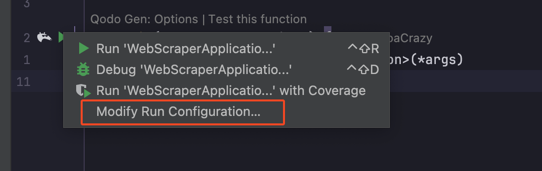
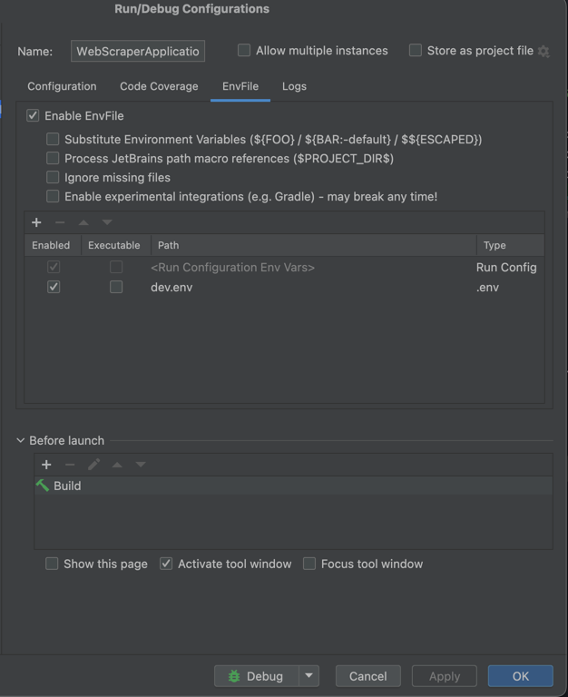

# WebScraper

A Kotlin/Spring Boot application for web scraping, data extraction, and integration with OpenAI's ChatGPT API. The project uses PostgreSQL as its database and supports both local and Docker-based development.

---

## Table of Contents
- [Prerequisites](#prerequisites)
- [Configuration](#configuration)
  - [dev.env Example](#devenv-example)
  - [Environment Variable Explanations](#environment-variable-explanations)
- [Running Locally](#running-locally)
- [Running with Docker](#running-with-docker)
- [Useful Commands](#useful-commands)
- [Notes](#notes)

---

## Prerequisites
- Java 17+
- Maven 3.8+
- Docker & Docker Compose (for containerized setup)

---

## Configuration

The application uses environment variables for configuration. These are typically set in the `dev.env` file at the project root. The variables are injected into `src/main/resources/application.properties` via Spring Boot's property resolution.

### dev.env Example
```env
APP_SERVER_BACKEND_URL=http://localhost:${SERVER_PORT}
APP_SERVER_URL=http://localhost:8080
SPRING_APPLICATION_NAME=webscraper
CHATGPT_API_KEY=sk-...your-openai-key...
CHATGPT_BASE_URL=https://api.openai.com/v1/chat/completions
SWAGGER_USERNAME=admin
SWAGGER_PASSWORD=password
DATABASE_PORT=5432
DATABASE_URL=jdbc:postgresql://localhost:${DATABASE_PORT}/webscraper
DATABASE_USERNAME=webscraper
DATABASE_PASSWORD=webscraper
SHOW_SQL_IN_LOGS=true
SCRAPER_RESULTS_DIR=/path/to/results
LOGS_DIR=/path/to/logs
LOG_LEVEL_CONSOLE=INFO
LOG_LEVEL_FILE=DEBUG
SERVER_PORT=8081
API_KEY=your-api-key
```

### Environment Variable Explanations
| Variable                | Description                                                                 | Used In                        |
|-------------------------|-----------------------------------------------------------------------------|--------------------------------|
| `APP_SERVER_BACKEND_URL`| Backend server URL (used for internal API calls)                            | application.properties         |
| `APP_SERVER_URL`        | Public server URL (used for external access)                                | application.properties         |
| `SPRING_APPLICATION_NAME`| Spring Boot application name                                               | application.properties         |
| `CHATGPT_API_KEY`       | OpenAI API key for ChatGPT integration                                      | application.properties         |
| `CHATGPT_BASE_URL`      | Base URL for ChatGPT API                                                    | application.properties         |
| `SWAGGER_USERNAME`      | Username for Swagger UI authentication                                      | application.properties         |
| `SWAGGER_PASSWORD`      | Password for Swagger UI authentication                                      | application.properties         |
| `DATABASE_PORT`         | PostgreSQL port                                                             | docker-compose, dev.env        |
| `DATABASE_URL`          | JDBC URL for PostgreSQL connection                                          | application.properties         |
| `DATABASE_USERNAME`     | PostgreSQL username                                                         | application.properties, docker |
| `DATABASE_PASSWORD`     | PostgreSQL password                                                         | application.properties, docker |
| `SHOW_SQL_IN_LOGS`      | Show SQL statements in logs (true/false)                                    | application.properties         |
| `SCRAPER_RESULTS_DIR`   | Directory to store scraping results                                         | application.properties         |
| `LOGS_DIR`              | Directory to store log files                                                | application.properties         |
| `LOG_LEVEL_CONSOLE`     | Log level for console output (e.g., INFO, DEBUG)                            | application.properties         |
| `LOG_LEVEL_FILE`        | Log level for file output (e.g., INFO, DEBUG)                               | application.properties         |
| `SERVER_PORT`           | Port for the web application                                                | application.properties, docker |
| `API_KEY`               | API key for authenticating requests                                         | application.properties         |

---

## Running Locally

1. **Clone the repository**
   ```sh
    git clone <repo-url>
    cd WebScraper
   ```

2. **Set up the environment**
   - Copy `dev.env` to the project root (edit values as needed).
   - Ensure PostgreSQL is running locally and matches the credentials in `dev.env`.

3. **Build the project**
   ```sh
    mvn clean install
   ```

4. **Run the application**
   ```sh
    mvn spring-boot:run
   ```
   The application will start on the port specified by `SERVER_PORT` (default: 8081).
   
Also you can run the application from Intellij IDEA (recommended).
1. Go to settings, plugins and look for plugin ".env file support". 
2. Press shift 2 times and search for WebScraperApplication.kt.
3. You press right click and Modify Run Configuration...
4. If you did everything correctly, you will see the run configuration with the name "WebScraperApplicationKt" and you will see the part Env file and there you will need to add `dev.env` file.
5. Now you can run the application by pressing the green arrow in the top right corner of the IDE or by pressing `Shift + F10`.
---

## Running with Docker

1. **Ensure Docker and Docker Compose are installed.**

2. **Edit `dev.env`**
   - Make sure all variables are set appropriately for your environment.

3. **Start the services**
   ```sh
    docker-compose --env-file ./dev.env up -d --build
   ```
   Please ensure that the `dev.env` file is in the project root directory. The `docker-compose.yml` file will use this environment file to configure the services.
   This will start both the PostgreSQL database and the WebScraper application.

4. **Access the application**
   - API: `http://localhost:<SERVER_PORT>`
   - Swagger UI: `http://localhost:<SERVER_PORT>/swagger-ui.html` (login with `SWAGGER_USERNAME`/`SWAGGER_PASSWORD`)

5. **Stop the services**
   ```sh
    docker-compose down
   ```

---

## Useful Commands

- **Run tests:**
  ```sh
  mvn test
  ```
- **Build Docker image only:**
  ```sh
  docker build -t webscraper .
  ```
- **View logs:**
  ```sh
  docker-compose logs -f
  ```

---

## Notes
- Please take into account that if you are on MacOS or Linux, you may just use the path as usal, but if you are on Windows, you may need to use a path like `C:/path/to/results` or `D:/path/to/logs` if you want the logs locally, while for the Docker you will have to use paths like for Linux.
- The `SCRAPER_RESULTS_DIR` and `LOGS_DIR` directories must exist and be writable by the application (especially when running locally).
- The application expects a valid OpenAI API key for ChatGPT integration.
- The API is protected by an API key (`API_KEY`), which must be provided in requests (see code for details).
- For production, use secure credentials and update environment variables accordingly.

---

For further details, see the source code and configuration files in the repository.